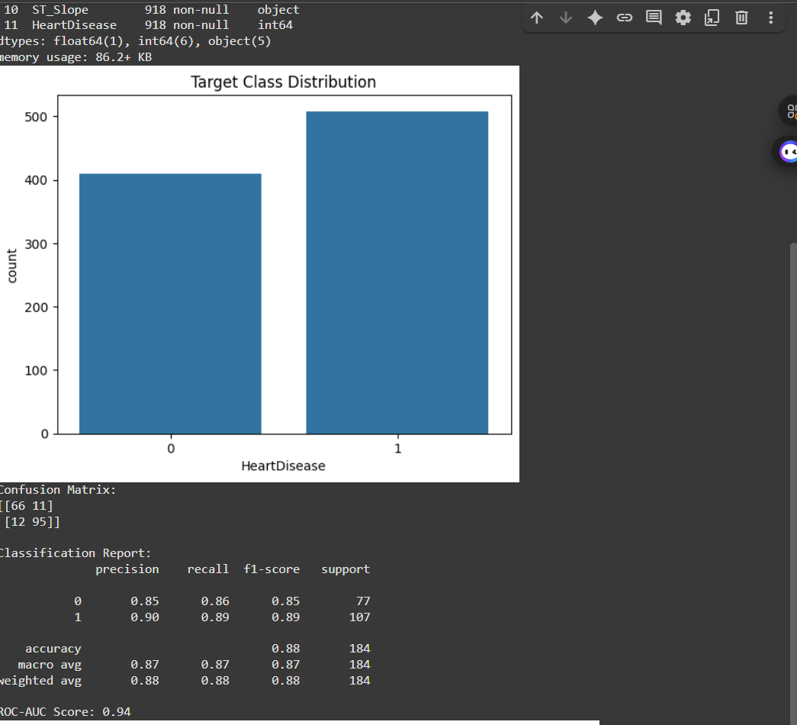
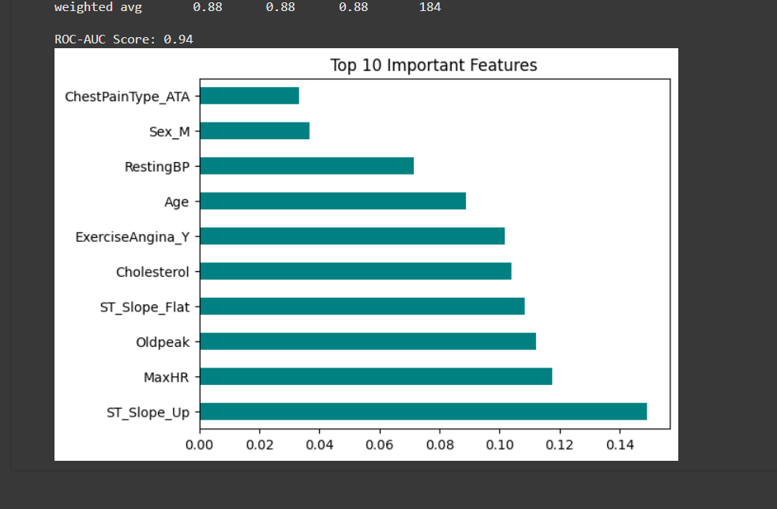

# CodeAlpha Disease Prediction

🩺 As part of my CodeAlpha Machine Learning Internship, I developed a model to predict the likelihood of diseases based on patient data using classification algorithms.

---

## 📊 Project Highlights:
- Predicts heart disease risk using patient health metrics.
- Applied **Random Forest Classifier** for high accuracy.
- Evaluated model with **Confusion Matrix, Classification Report, ROC-AUC Score**.
- Visualized feature importance to interpret predictions disease risk from medical data
- Used models: Logistic Regression, Random Forest, SVM
- Evaluated with accuracy, precision, recall, and F1-score

---

## 🗂 Dataset:
- **File:** `heart.csv` (included in repository)  
- **Description:** Contains patient health records with attributes such as age, sex, blood pressure, cholesterol levels, and more.  
- **Target Variable:** `HeartDisease` (1 = Disease Present, 0 = No Disease)

---

## 🧠 Methodology
1. **Data Exploration**  
   - Checked for missing values and data types.  
   - Visualized class distribution of target variable.

2. **Data Preprocessing**  
   - One-hot encoding for categorical variables.  
   - Train-test split (80% training, 20% testing).

3. **Model Training**  
   - Algorithm: **Random Forest Classifier**  
   - Evaluated with Accuracy, Precision, Recall, F1-score, and ROC-AUC.

4. **Feature Importance**  
   - Identified top predictors for heart disease risk.

---

## 🛠 Technologies:
- Python
- Scikit-learn
- Pandas, NumPy
- Matplotlib, Seaborn

---

## 📈 Results
- **ROC-AUC Score:** 0.94  
- **Top Features:** ST_Slope_Up, MaxHR, Oldpeak, Cholesterol, Age, RestingBP, etc.

---

## 📷 Visual Outputs
### Target Class Distribution

### Model Performance
**Confusion Matrix & Classification Report**  
- Accuracy: 88%  
- Precision (Class 1): 0.90  
- Recall (Class 1): 0.89  

### Top 10 Important Features

---

*Project completed for the CodeAlpha Machine Learning Internship*
